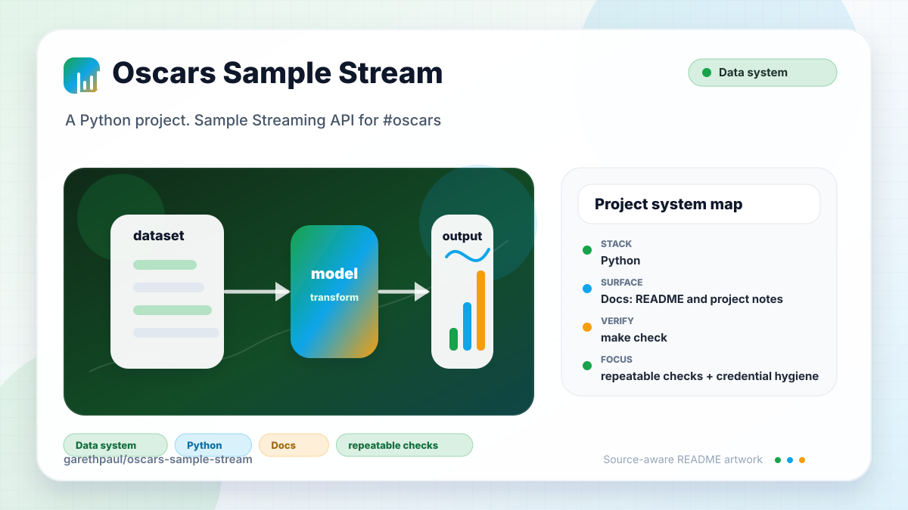

# oscars-sample-stream

<!-- README-OVERVIEW-IMAGE -->


## Overview

`garethpaul/oscars-sample-stream` is a Python project. Sample Streaming API for #oscars

The maintained worker targets Python 3.10 or newer and uses the Twitter/X API
v2 filtered stream through Tweepy 4.16.0 `StreamingClient` plus PyMongo 4.17.0.

## Repository Contents

- `CHANGES.md` - baseline change log
- `Makefile` - local no-network verification entry point
- `README.md` - project overview and local usage notes
- `requirements.txt` - exact direct runtime dependency pins
- `requirements.lock` - exact hash-locked production dependency graph
- `requirements-audit.lock` - exact hash-locked pip-audit tool graph
- `Procfile`
- `SECURITY.md` - security reporting and disclosure guidance
- `config.py` - environment-variable configuration loader
- `sample_stream.py` - Tweepy stream worker
- `test_sample_stream.py` - no-network tests with fake Twitter and MongoDB clients
- `scripts/check-baseline.py` - static baseline checks used by `make check`
- `docs/plans/2026-06-08-oscars-stream-baseline.md` - completed hardening plan
- `VISION.md` - project direction and maintenance guardrails

Additional scan context:

- Source directories: no top-level source directories detected
- Dependency and build manifests: Procfile, requirements.txt
- Entry points or build surfaces: none detected
- Test-looking files: no obvious test files detected

## Getting Started

### Prerequisites

- Git
- Python 3.10 or newer

### Setup

```bash
git clone https://github.com/garethpaul/oscars-sample-stream.git
cd oscars-sample-stream
python3 -m venv .venv
. .venv/bin/activate
python -m pip install --require-hashes -r requirements.lock
```

Keep audit tooling out of the worker environment. From a separate audit venv,
install `requirements-audit.lock` with `--require-hashes`, then verify the
production graph:

```bash
python3 -m venv .venv-audit
. .venv-audit/bin/activate
python -m pip install --require-hashes -r requirements-audit.lock
python -m pip_audit --require-hashes --no-deps -r requirements.lock
```

## Running or Using the Project

- Preview the exact tagged rule and stream options without credentials, remote
  rule changes, MongoDB access, or network calls:

  ```bash
  python sample_stream.py --dry-run
  python sample_stream.py --dry-run --track-term '#oscars2026' --track-term 'best picture'
  ```

  Dry-run output is stable JSON. It validates the same normalization, term
  count, quoting, and 512-byte rule limit as live startup, but it does not prove
  Twitter/X authorization, remote rule state, stream connectivity, or MongoDB
  access.
- Configure a Twitter/X API v2 bearer token with `bearer_token` or
  `BEARER_TOKEN`.
- Configure MongoDB with `MONGOHQ_URL` or `MONGO_URL`.
- Blank environment values are ignored so fallback variable names can be used.
- Run `python sample_stream.py` or the Heroku `worker` process from `Procfile`.
- The default stream filter is `#oscars`. The worker replaces only persistent
  API v2 rules tagged `oscars-sample-stream`; unrelated project rules are not
  deleted. If the existing-rule query fails, startup stops before adding,
  deleting, or filtering so project-wide rule state is not changed blindly.
  A single matching tagged rule is reused without add/delete calls; stale,
  missing, or duplicate tagged state still follows the convergence path.
  After a replacement is added, a rejected stale-rule deletion stops startup
  before filtering so partial remote synchronization is visible to operators.
- Custom stream filters must contain at least one non-empty string after
  trimming; blank custom stream filters are rejected instead of silently using
  the default.
- Non-iterable custom stream filters are rejected with the same validation path
  instead of raising a raw type error.
- Mapping custom stream filters are rejected instead of treating mapping keys as
  implicit track terms.
- Bounded track term preflight runs before API or Mongo-backed listener setup
  and rejects custom iterables containing more than 100 values.
- Non-string raw stream payloads are ignored like malformed JSON so the worker
  keeps running on unexpected callbacks.
- Explicit MongoDB client injection is honored for no-network tests instead of
  falling back to a configured MongoDB URL when a fake client is falsy.
- API v2 author expansion is required before storage: tweet `text` and the
  matching expanded `username` must be non-empty strings after trimming.
- Twitter/X streaming statuses `420` and `429` disconnect the client instead
  of repeatedly reconnecting while rate limited.
- MongoDB writes use PyMongo `insert_one`; tests preserve explicit falsy client
  injection without contacting a database.
- Local verification runs with Python bytecode writes disabled so no
  `__pycache__` output remains after the no-network gates.

## Testing and Verification

- `make check`
- `make lint`
- `make build`
- `make verify`
- `python3 -m unittest discover -v`
- `python3 scripts/check-baseline.py`
- Pinned hosted Linux validation installs the exact hash-locked requirements and runs the
  no-network `make check` gate on Python 3.10 and 3.12 without credentials.
- A separate Python 3.12 job installs the hash-locked audit-tool graph and
  audits the resolved production graph without dependency resolution.

When the required SDK or runtime is unavailable, use static checks and source review first, then verify on a machine that has the matching platform toolchain.

## Configuration and Secrets

- Keep bearer tokens and account-specific values in local configuration only.
- Never commit Twitter credentials, MongoDB URLs, captured posts, or local `.env`
  files.

## Security and Privacy Notes

- Review changes touching authentication or token handling; examples from the scan include sample_stream.py.
- Review changes touching file, media, JSON, XML, CSV, OCR, or data parsing; examples from the scan include sample_stream.py.
- The test suite uses no-network tests with fake Tweepy and MongoDB clients so
  stream behavior can be verified without live credentials.
- Python bytecode is local tooling output and should not remain after
  `make check`.
- Non-string or whitespace-only required stream fields are ignored instead of
  being written to MongoDB.
- Blank environment values should not satisfy required credential or Mongo URL
  settings.
- Custom stream filters are normalized before starting Tweepy so collection
  scope stays explicit.
- Non-iterable custom stream filters should fail validation before stream
  startup.
- Mapping custom stream filters should fail validation instead of deriving track
  terms from dictionary keys.
- Non-string raw stream payloads should not terminate the streaming worker.
- Explicit MongoDB client injection should stay reliable for fake clients used
  in no-network tests.
- Tagged API v2 rule replacement must never delete another worker's rules.
- Failed tagged-rule deletion must not be treated as successful synchronization
  or allow filter startup to continue.
- Stream payloads without a matching expanded author must not be stored.

## Maintenance Notes

- Run `make check`, `make lint`, `make build`, and `make verify` before
  changing stream startup, credential handling, MongoDB writes, or the
  `#oscars` filter.
- Standard Make aliases resolve unittest discovery and checker paths from
  `Makefile`, so an absolute Makefile path works from another directory.
- See `CHANGES.md` and `docs/plans/2026-06-08-oscars-stream-baseline.md` for
  the current worker baseline.
- See `docs/plans/2026-06-10-hosted-no-network-validation.md` for the hosted
  Linux no-network test contract.
- See `docs/plans/2026-06-12-modern-stream-dependencies.md` for the API v2,
  bearer-token, tagged-rule, PyMongo, and dependency-audit migration.
- See `SECURITY.md` for vulnerability reporting and safe research guidance.
- See `VISION.md` for project direction and contribution guardrails.

## Contributing

Keep changes small and tied to the project that is already present in this repository. For code changes, document the toolchain used, avoid committing generated dependency directories or local configuration, and update this README when setup or verification steps change.
